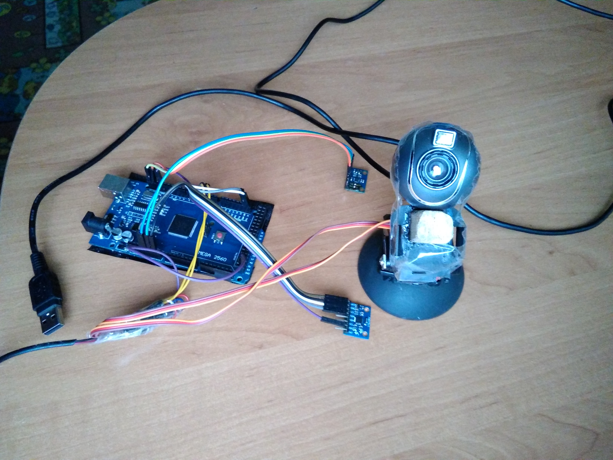

# Arduino Turret

Турель на Arduino с системой стабилизации на MPU9250 (гироскоп + акселерометр) и протоколом обмена данными.

## Возможности

- 🎯 Стабилизация позиции турели (2 сервопривода)
- 📡 IMU MPU9250 (гироскоп + акселерометр)
- 🧭 Madgwick filter для ориентации (кватернионы)
- 🔄 Протокол обмена данными (start/stop маркеры, HEX длина)
- 🎮 Управление с ПК через Serial
- ⏱ Timeout для безопасного отключения

## Протокол обмена

Arduino turret with MPU9250-based stabilization and serial communication protocol from PC
